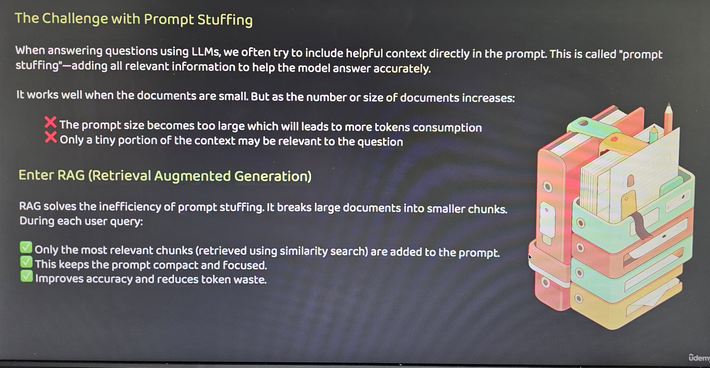
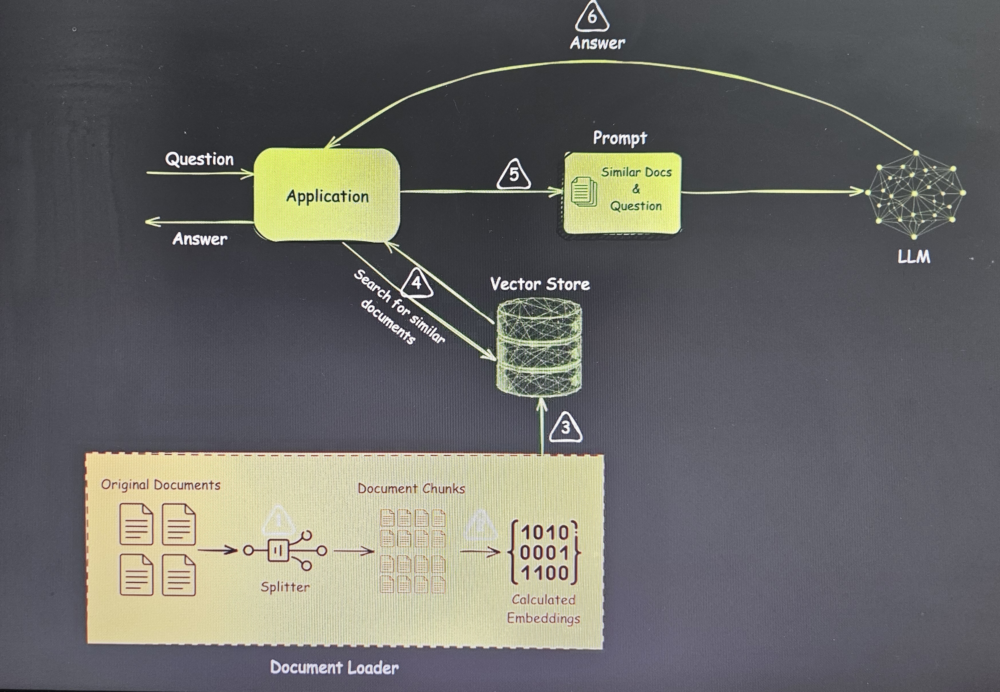

# RAG Architecture

[Spring AI Documentation](https://docs.spring.io/spring-ai/reference/index.html)

## Workflow Components

1. **User Query**
2. **Query Embedding**
3. **Vector Database**
4. **Similarity Search**
5. **Retrieved Documents**
6. **Context + Query**
7. **LLM**
8. **Response**

## Process Flow

The RAG (Retrieval-Augmented Generation) architecture follows this sequence:

1. A user submits a query.
2. The query is converted into a vector embedding
3. The embedding is used to search the vector database
4. Similarity search finds relevant documents
5. Retrieved documents are extracted
6. Context from retrieved documents is combined with the original query
7. The augmented query is processed by the LLM
8. A response is generated based on both the query and retrieved context

RAG: Giving LLMs Superpowers with External Knowledge

You give a prompt

    1. RAG searches a knowledge base for relevant documents or information
    2. These fetched data/documents are added as context to the LLM
    3. Then the LLM generates a more accurate and grounded answer

- ✓ LLM now has access to the right info — even private, dynamic, or domain‑specific!  
- ✓ Allows light personalization based on user or context

RAG = Retrieval + Augmentation + Generation
A smart way to give language models access to external knowledge so they can give better, more accurate answers.
''
USER: tell me about product X.
- Retriever: Search company docs, PDFs, or a vector database
- Augmenter: Picks the most relevant chunks of text
- Generator(LLM): Writes an answer using that retrieved knowledge

✓ More accurate, up-to-date, and personalized response!

Find more about supported vector databases:[Spring AI Documentation](https://docs.spring.io/spring-ai/reference/index.html)

Note: VectorStore is required in spring to communicate with Vectore db.
    VectorStore injects (QdrantClient, EmbeddingModel)
- for Multi model applicatin with 2 EmbeddingModels (different vector sizes) configuration is needed. check QdrantMultiModelConfig.java

